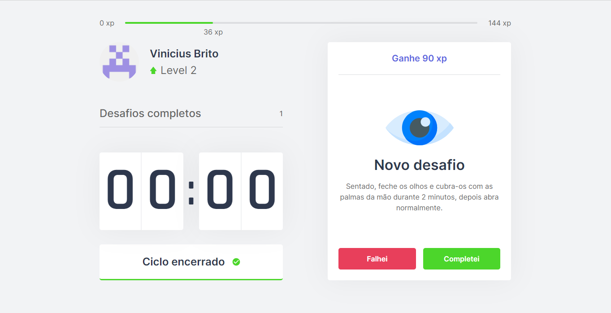

# Move.it - NLW #4

Aplicação desenvolvida durante o evento NLW #4 da Rocketseat na trilha de ReactJS onde utilizamos o Next.JS para construção do website selecionado como objeto de estudo.

_Move.it_ tem como objetivo trazer desafios (para relaxamento físico e ocular) à profissionais que trabalham muito tempo em frente ao computador, e, muitas vezes, não percebem potenciais danos à longo prazo para a visão, tendões e articulações.
Assim, a aplicação _Move.it_ traz à seus usuários melhor qualidade de vida de forma lúdica, completando desafios e subindo de nível conforme a experiência adquirida!



## Criação da aplicação


A criação da aplicação foi baseada no layout [Move.it 1.0](https://www.figma.com/file/ge20pu3ofMOKoliUyKx1Nl/Move.it-1.0/duplicate) disponibilizado pela [Rockeatseat](https://rocketseat.com.br/)

_Como projeto futuro, serão desenvolvidas melhorias baseadas no protótipo de [Move.it 2.0](https://www.figma.com/file/vRbW1u0CEZuG2zE6bU5qLg/Move.it-2.0/duplicate), também disponibilizado pela Rocketseat._

## Configurações de desenvolvimento

Para instalar as dependências utilizadas no desenvolvimento, é necessário executar a linha de comando abaixo para compatibilidade com a linguagem TypeScript.

```sh
yarn add @types/next @types/react @types/react-dom @types/js-cookie

# ou

npm install @types/next @types/react @types/react-dom @types/js-cookie
```

Em seguida, basta executar a seguinte linha de comando para iniciar um servidor local com atualização automática.

A aplicação vai iniciar em http://localhost:3000 por padrão, mas pode ser alterada com '-p' da seguinte forma:

```sh
yarn dev -p 4000

# ou

npx next dev -p 4000
```


## Histórico de lançamentos *

* 0.1.0
    * Primeiro lançamento da plataforma, conforme conteúdo disponibilizado pela Rocketseat.

### * Demais versões serão disponibilizadas no [repositório de produção](https://github.com/Vini3Brito/moveit-nlw4-prod/) da aplicação.

## Autor

Para sugestões, dicas ou reclamações:

Vinicius Brito – viniclementebrito@gmail.com

[https://github.com/Vini3Brito](https://github.com/Vini3Brito/)
